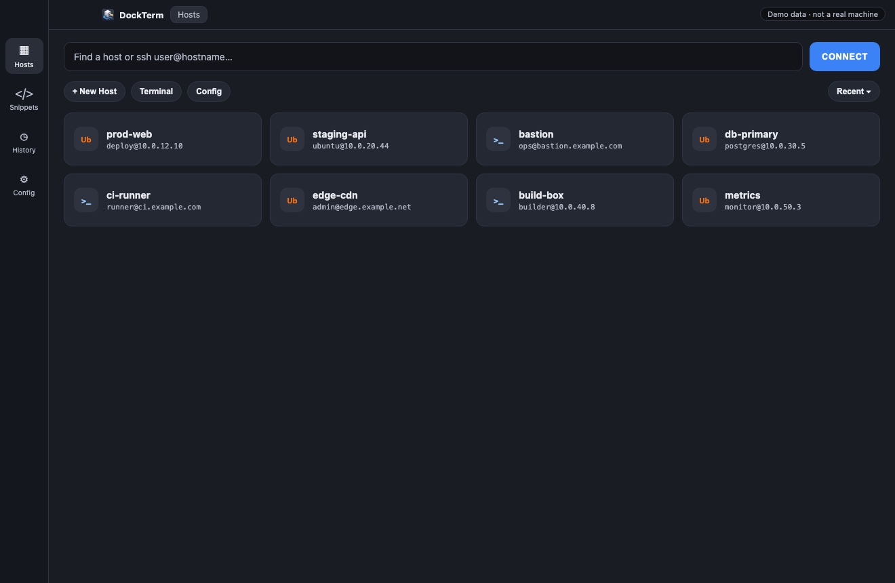

# DockTerm

**SSH workspace for macOS, Windows, and Linux** — custom hosts from `~/.ssh/config`, command **snippets**, searchable **history**, multi-tab sessions, and remote process tools in one Electron app.

[](https://github.com/bewithdhanu/dockterm/releases/tag/v1.0.0)
[](https://bewithdhanu.github.io/dockterm/)
[](./LICENSE)

<p align="center">
  
</p>

<p align="center">
  <em>UI preview uses fictional demo hosts — not real machine data.</em>
</p>

<p align="center">
  <a href="https://bewithdhanu.github.io/dockterm/"><strong>Product page →</strong></a>
  ·
  <a href="https://github.com/bewithdhanu/dockterm/releases"><strong>Download builds →</strong></a>
</p>

---

## Why DockTerm?

Most SSH clients stop at a black box. DockTerm is a full workspace around your servers:

### Custom SSH hosts & config
- Reads and writes **`~/.ssh/config`** (aliases, `HostName`, `User`, `Port`, `IdentityFile`, `ProxyJump`, `Include`, and more)
- Add / edit hosts in the UI with identity file picker and key preview
- Full **Monaco config editor** when you need raw OpenSSH power

### Snippets
- Save named commands and replay them into any active terminal
- Stored in `~/.ssh/shippets` — easy to back up or sync
- Snippet runs stay out of typed command history

### Command history
- Every command you type is kept with host context
- Search, filter, open a detail pane, then **Run** or **Copy**
- Built for “what did I run on prod last week?” moments

### Multi-tab workspace
- Multiple SSH (and local) sessions in one window
- Split panes for staging / prod / bastion side by side
- Terminal themes, clickable links, OS badges on hosts

### Ops tools
- Top processes, listening ports, **pkill by PID or port**
- Session stats (CPU/RAM-style remote info when available)
- Passwordless `sudo -n` when your server allows it

Keywords: *SSH client*, *SSH terminal*, *SSH snippets*, *command history*, *multi-tab SSH*, *~/.ssh/config GUI*, *Electron terminal*, *xterm.js*, *remote process manager*.

## Features at a glance

| Feature | Details |
| --- | --- |
| **Custom SSH hosts** | `~/.ssh/config` sync, IdentityFile, ProxyJump, Include-aware |
| **Snippets** | Named commands, one-click run into the focused pane |
| **History** | Searchable typed-command log with re-run / copy |
| **Tabs & splits** | Multi-session workspace with split panes |
| **Config editor** | Monaco editor for the full OpenSSH config |
| **Themes** | Multiple terminal color themes |
| **Procs / ports** | List + kill by PID or listening port |
| **Desktop** | macOS / Windows / Linux — bundled Node, no system install |

## Download

**Latest:** [v1.0.0](https://github.com/bewithdhanu/dockterm/releases/tag/v1.0.0)

Prebuilt installers for six targets:

- macOS Apple Silicon (arm64) — `.dmg` / `.zip`
- macOS Intel (x64) — `.dmg` / `.zip`
- Windows — NSIS `.exe`
- Linux x64 / arm64 — `.AppImage`

> Unsigned macOS builds: right-click the app → **Open** the first time (Gatekeeper).

## Quick start (development)

Requires **Node.js 20–22** for local development only. Packaged apps bundle their own Node.

```bash
git clone https://github.com/bewithdhanu/dockterm.git
cd dockterm
npm install
npm run dev          # web UI + backend (http://localhost:5173)
npm run desktop      # Electron desktop shell
npm run dist:dir     # package for the current OS/arch
```

### Useful scripts

| Script | Purpose |
| --- | --- |
| `npm run dev` | Vite client + Express/WS server |
| `npm run desktop` | Build UI, fetch bundled Node, launch Electron |
| `npm run dist:mac` / `dist:win` / `dist:linux` | Platform installers |
| `npm run runtime:node` | Download the official Node binary into `runtime/` |

## Architecture

```
DockTerm.app (Electron)
├── Renderer — React + xterm.js UI
└── Backend  — bundled Node + Express + WebSocket + node-pty
              (SSH sessions, hosts, snippets, process tools)
```

The desktop shell prefers `Contents/Resources/app/runtime/node` so end users do **not** need Node installed, and a system Node of another version will not conflict.

## Configuration & data

| Path | Purpose |
| --- | --- |
| `~/.ssh/config` | SSH hosts (read/write via DockTerm) |
| `~/.ssh/shippets` | Command snippets |
| `~/Library/Logs/DockTerm/` (macOS) | Desktop startup / backend logs |

## Continuous delivery

GitHub Actions (`.github/workflows/build-desktop.yml`) builds all six platform/arch combinations and can publish a Release when you push a `v*` tag.

```bash
git tag v1.0.0
git push origin v1.0.0
```

## Stack

- **Electron** + **React** + **Vite**
- **xterm.js** (fit, serialize, web-links)
- **node-pty** for local/SSH PTYs
- **Express** + **ws** backend
- **Monaco** for config editing

## Showcase

Marketing / product page (GitHub Pages):

**https://bewithdhanu.github.io/dockterm/**

## Contributing

Issues and PRs are welcome. For packaging changes, test with `npm run dist:dir` on your OS before opening a PR.

## License

[MIT](./LICENSE) © DockTerm contributors
